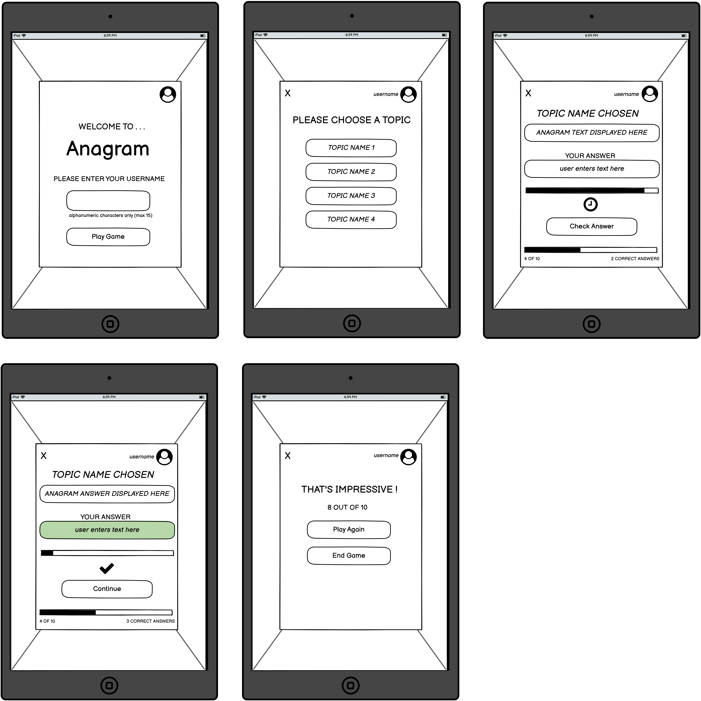

<h1 align="center">ANAGRAM word puzzle Website</h1>

[View the live project here](https://elainebroche-dev.github.io/ms2-anagram/)

ANAGRAM is an online word game.  The user is asked to identify themselves using a username and then can choose from a range of topics.  Once a topic has been chosen the user is asked 10 questions selected randonmly from the list of questions that are available for that topic.  One question/anagram is shown at a time and the user has a 1 minute time limit to guess the anagram.  Once the user enters an answer and clicks "Check Answer", the game gives feedback as to whether the answer was correct or not, and also displays the correct answer.  A progress bar, question count and correct answer count on-screen show the user where they are in the current round and how they are doing.  At the end of the 10 question round the user is brought to an end-of-round screen to see their score and get feedback - from this point they can choose to end the game or go back and select a new topic and try again.

The questions currently available on the website are quite tricky and so probably best suited to an audience of older players - however, this data is separate from the coding.   Behind the scenes, the data could be modified to change the selection of topics or change the questions asked (e.g. adding more questions would improve the 'randomness' of the rounds).  A potential future feature could be the provision of a user-interface to change this data.

## Index – Table of Contents
* [User Experience (UX)](#user-experience-ux) 
* [Features](#features)
* [Design](#design)
* [Technologies Used](#technologies-used)
* [Testing](#testing)
* [Deployment](#deployment)
* [Credits](#credits)

## User Experience (UX)

-   ### User stories

    -   #### As a user I want to be able to :

        1. Enter a username and have this visible on screen while the game is in progress.
        2. Choose from a list of topics to answer questions on.
        3. Play a round of 10 random anagram questions on the topic selected.
        4. Easily tell which question of the round is being asked.
        5. See a running total of correct answers.
        6. See a timer to indicate how much time is left to enter an answer.
        7. Get feedback on whether or not the correct answer has been entered.
        8. At the end of the round get feedback on overall score for the round.
        9. Navigate easily between the game screens, including quitting a round, playing another round or ending the game.

## Features

### Existing Features

-   __F01 Navigation between screens__
    - The game is comprised of 4 screens :

        1. Username/Login screen
        2. Select Topic screen
        3. Play Game screen
        4. End of Round screen

    - Normally, navigation through the screens will happen by interacting with the game selection buttons to play the game.  However, there is also an "X" at the top left of each screen to help the user navigate more quickly.  Clicking on the "X" when on the Username/Login screen (1) will close the browser window.  Clicking on the "X" when on the Select Topic screen (2) will end the current game and return the user to the Username/Login screen (1).  Clicking the "X" when on either the Play Game screen (3) or End of Round screen (4) will end the round and return the user to the Select Topic screen (2).

      

-   __F02 Capture Username__

    - When the website loads the user is asked to enter a username (see screenshot below).  The username needs to be betwen 1 and 15 characters long (inclusive).  The characters should all be alphanumeric - upper or lower case A-Z and digits 0-9.  The code uses a regular expression to validate the input string.  If the user has entered an invalid username then a feedback message is shown on-screen and the user can try again.  Once a valid username is entered the user is taken to the topic selection screen and the username is displayed on the top right beside the user icon until the user chooses to end the game.

      

-   __F03 Select Topic__

    - Depending on the data available the user will be shown a maximum of 4 topic buttons to select from - currently data for 4 topics has been provided and so the screen will appear as shown in the below screenshot.  Each button is labelled with the topic title.  The user can quit the game at this point by clicking on the "X" at the top left of the screen. Clicking on a topic button will start a round of questions on the selected topic.

      

-   __F04 Play a round of 10 anagrams (Play Game screen)__

    - Once the user has selected a topic the main game screen is shown.  There are a number of features on this screen, most are detailed in separate feature paragraphs below.  At a high level, this screen screen behaves as follows :
        1. The username and selected Topic Title are displayed on screen.
        2. User is presented with a question/anagram and 60 second timer is started.
        3. User enters their answer and clicks "Check Answer"  - or if the timer has run out before the user has answered then the game acts as though "Check Answer" has been clicked.
        4. The game gives the user feedback on whether or not the correct answer was entered - the background of the answer text box changes to red (wrong) or green (correct) and a "X" or tick symbol icon is displayed.  The number of correct answers is updated as appropriate and displayed on the bottom right of the screen. The "Check Answer" button changes to a "Continue" button at this point (or "End Round" button if this is question 10) to give the user an opportunity to review the feedback.
        5. Once the user is ready to move on, they click the "Continue" button to move to the next question/anagram.  The progress bar and question number features at the bottom of the screen are updated, a new question is displayed and the timer is refreshed.
        6. As mentioned, on answering question 10, the "Check Answer" button changes to an "End Round" button, when the user clicks on this they get feedback for the full round of questions.

    - Clicking the "X" at the top left of the screen will bring the user back to the "Select Topic" screen.

      

-   __F05 Anagram Timer__
    - On the Play Game screen, the user is given 60 seconds to enter their answer to the current anagram question.  The timer is presented as a bar at the top of the screen which reduces in width to show the decreasing time remaining.

    - The timer is stopped if the "Check Answer" button is clicked or if the user clicks the "X" on the top left of the screen to return to the "Select Topic" screen.

      

-   __F06 Progress Bar and "X OF 10" phrase__
    - On the Play Game screen, both of these elements support the user in easily seeing how far they have progressed in the current round of anagrams/questions. The progress bar increases in width by 10% as each new question is displayed and the X value of the "X OF 10" phrase at the bottom right of the screen also gets incremented.

      

-   __F07 Running total of correct answers__
    - On the Play Game screen, there is a "N CORRECT ANSWERS" phrase on the bottom right of the screen that keeps a running total of the number of questions the user has answered correctly in the current round - this supports the user in easily seeing their running tally.

      

-   __F08 Check Answer button__
    - On the Play Game screen, the user's answer is checked when either a) the user clicks the Check Answer button b) the user presses the Enter key when focus is on the answer text field or c) when the timer runs out (60 seconds).  When the Check Answer is triggered a number of changes happen.

        1. The timer is stopped.
        2. The question text displayed on screen is replaced with the expected answer text.
        3. The answer given by the user is checked to see if it matches the expected answer.
        4. If the user answer is correct, the background of the input text field turns green, the tick symbol icon is displayed under the input field and the X value in the "X CORRECT ANSWERS" phrase is increased by 1.
        5. If the user answer is not correct, the background of the input text field turns red, and an "X" icon is displayed under the input field.
        6. The Check Answer button becomes a Continue button (F09) (or End Round button (F10) if the current question is the last question).
    
      

      

      
   
-   __F09 Continue button__
    - On the Play Game screen, the Continue button allows the user to contol the timing of when they move on to the next question.  When they have had a chance to review the feedback from the question just finished, they can then click Continue, this will trigger a number of changes.

        1. The timer is refreshed to 60 seconds and started.
        2. The question text displayed on screen is updated to show the next question.
        3. The user input area is cleared and the background set to white.
        4. The icon under input area is changed to a clock symbol indicating that the timer is running.
        5. The progress bar is increased by 10% and N value in "N OF 10" increased by 1 to reflect that the game has moved on.
        6. The Continue button reverts to being the Check Answer button.

      

-   __F10 End of Round screen__
    - As noted under the description of F08 above, the Check Answer button becomes the End Round button once the user answers the last question in the round of 10.   Once they have reviewed the feedback for question 10 and clicked on the End Round button they are brought to the End of Round screen which shows their total score for the round and displays a message based on that score (see screenshot below).  At this point the user can Play Again - whcih will bring them back to the Select Topic screen, or End Game which brings them back to the initial screen and clears out the username.

      
    
- __How these features support the User Stories__

    - The User Stories in the [User Experience (UX)](#user-experience-ux) part of this document are numbered 1-9.  The existing features are listed above as F01 to F10.  Below is a traceability matrix cross-referencing the user stories with the features, illustrating which features support which stories :

        

### Features which could be implemented in the future

- __Store user scores__
    - Currently the user is asked to enter a username but that is only used to display the name on screen.  Functionality could be added to upload results for that user to a website so it could be compared against other player results or the user could use it to try to beat their own high-score.

- __Provide user-interface to manage topic and question data__
    - All data for the topic titles and anagram questions and answers is stored separately to the code to run the game.  Functionality could be added to provide an "admin" screen to allow this data to be changed (add/delete/modify) to build similar quizzes for a different audience.

- __Extend Topic selection functionality__
    - A maximum of 4 topic titles are listed on the topics screen.  Functionality could be added so that if more than 4 titles were available in the quiz data structure then either a random selection of 4 titles could be picked, or all available titles could be presented to the user to choose from.

- __Extend error handling__
    - Basic error catch/throw code has been added to the project at some critical function points.  As the Topic and Anagram data is stored in an external js file, there are some checks around this data in relation to assumptions and dependencies in the code - e.g. a check to make sure the "quiz" data structure exists and has a length > 0, and that at least 10 questions exist for each Topic.  However this could be extended and improved to support a more standardized approach to error handling.

## Design

-   ### Imagery
    - The abstract background image was chosen to complement the grey and orange colour scheme.  The overall effect is designed to look modern and appeal to an adult audience rather than younger players as the questions currently provided target this age group.
    - Features including the layout of the Play Game screen, positioning and behaviour of the "Check Answer" button, method of presentation of answer feedback, progress bar and behaviour of "X" in top left of screens were influenced by the UX features of the [Duolingo](https://www.duolingo.com/learn) application.

-   ### Colour Scheme
    -  The colour scheme across the screens was kept simple and consistent so that it wouldn't be distracting and was inspired by the colours used by the [Quiz House](https://play.google.com/store/apps/details?id=co.quizhouse&hl=en&gl=US) application and from a palette on [Scheme Color](https://www.schemecolor.com/very-dark-blue-grey-orange.php)

        

-   ### Typography
    -   Google Fonts were used to import the Questrial and Kiwi Maru fonts into styles.css. Questrial was chosen as it has a modern feel and is highly readable which is particularly important in the context of a word game site.  Kiwi Maru was chosen for the game title as it is similar to "typewriter" styles such as "American Typewriter" font and this theme seems appropriate for a word puzzle.

-   ### Wireframes

    

    
Desktop Wireframes

    
    

    

    
Tablet Wireframes

    
    

    

    
Smartphone Wireframes

    
    

    
## Technologies Used

### Languages Used

-   [HTML5](https://en.wikipedia.org/wiki/HTML5)
-   [CSS3](https://en.wikipedia.org/wiki/Cascading_Style_Sheets)
-   [Javascript](https://en.wikipedia.org/wiki/JavaScript)

### Frameworks, Libraries & Programs Used

-   [Google Fonts:](https://fonts.google.com/) was used to import the Questrial and Kiwi Maru fonts.
-   [Font Awesome:](https://fontawesome.com/) was used to add icons for aesthetic and UX purposes.
-   [Git:](https://git-scm.com/) was used for version control by utilising the Gitpod terminal to commit to Git and Push to GitHub.
-   [GitHub:](https://github.com/) is used as the respository for the projects code after being pushed from Git.
-   [Balsamiq:](https://balsamiq.com/) was used to create the wireframes during the design process.

## Testing

### Validator Testing - to be written and extended for JS

- [HTML Validator](https://validator.w3.org/)

    - result for to be written
      
  
    - Full validation results are available on github here :

        - <a href="to be written" target="_blank">to be written</a>

- [CSS Validator](https://jigsaw.w3.org/css-validator/)

    - result for styles.css 
      

      ????? to be written - The warnings are due to 1) import of the Google fonts and 2) a webkit extension for Safari support of the flip-card effect used on the home page.

    - Full validation results are available on github here :

        - <a href="to be written" target="_blank">to be written</a>

### Browser Compatibility

- Testing has been carried out on the following browsers :
    - to be written
    
### Test Cases and Results

- The below table details the test cases that were used, the results and a cross-reference to the Feature ID that each test case exercised (click to open iamge):

  

### Known bugs

- To be written

## Deployment

### How this site was deployed

- In the GitHub repository, navigate to the Settings tab, then choose Pages from the left hand menu 
- From the source section drop-down menu, select the Master Branch
- Once the master branch has been selected, the page will be automatically refreshed with a detailed ribbon display to indicate the successful deployment
- Any changes pushed to the master branch will take effect on the live project

  The live link can be found here - [ANAGRAM](https://elainebroche-dev.github.io/ms2-anagram/index.html) 

### How to clone the repository

- Go to the https://github.com/elainebroche-dev/ms2-anagram repository on GitHub 
- Click the "Code" button to the right of the screen, click HTTPs and copy the link there
- Open a GitBash terminal and navigate to the directory where you want to locate the clone
- On the command line, type "git clone" then paste in the copied url and press the Enter key to begin the clone process
 
## Credits 

### Content 
- The anagrams were sourced from a mixture of the below websites :
    - [Sporacle](https://www.sporcle.com/games/)
    - [Ready MAde Pub Quiz](https://readymadepubquiz.com/tag/anagrams/)
    - [Biblio Freak](https://www.bibliofreak.net/2015/06/anagrams-004-famous-authors.html)
    - [Fun Trivia](https://www.funtrivia.com/submitquiz.cfm)
    - [Freeology](https://freeology.com/reading/famous-books-anagrams/)

### Code 
- Code on how to do a full page background came from information on this website : [Full Page Backgound](https://css-tricks.com/perfect-full-page-background-image/ )
- Code on how to do the fade-in of the background image came from information on this website : [Fade In](https://blog.hubspot.com/website/css-fade-in)
- Code on how to do the button click effect using a border came from information on this website : [Button Click](https://stackoverflow.com/questions/9612758/add-a-css-border-on-hover-without-moving-the-element)
- Code on how to use a regular expression to validate the username came from information on this website : [Regular Expression](https://stackoverflow.com/questions/16299036/to-check-if-a-string-is-alphanumeric-in-javascripthttps://stackoverflow.com/questions/16299036/to-check-if-a-string-is-alphanumeric-in-javascript)
- Code to help parse strings came from information on this website : [Substring Example](https://stackoverflow.com/questions/10272773/split-string-on-the-first-white-space-occurrence/10272822)
- Code to check a range in a switch statement came from information on this website : [Switch Range](https://www.codegrepper.com/code-examples/javascript/javascript+switch+case+range)
- Code on how to use map to index into object array came from information on this website : [Map IndexOf](https://stackoverflow.com/questions/8668174/indexof-method-in-an-object-array)
- Code to create an array of unique random numbers came from information on this website : [Unique Random](https://stackoverflow.com/questions/2380019/generate-unique-random-numbers-between-1-and-100)
- Code to create random numbers within a specified min/max range came from information on this website : [Random Range](https://stackoverflow.com/questions/4959975/generate-random-number-between-two-numbers-in-javascript)
- Code to create the timer progress bar came from information on this website : [Timer Bar](https://www.w3schools.com/howto/howto_js_progressbar.asp)
- Code to replace multiple whitespace characters with a single space came from information on this website : [Replace Whitespace](https://stackoverflow.com/questions/1981349/regex-to-replace-multiple-spaces-with-a-single-space)
- Code on to add/remove icon classes using classList came from information on this website : [Classlist to Swap Icons](https://stackoverflow.com/questions/48612799/add-remove-class-fa-icon-javascript)
- Code to achieve the typewriter effect on the login screen came from examples on this website : [Typewriter Effect](https://www.w3schools.com/howto/howto_js_typewriter.asp)
- Code to do the fade-in of the game title came from information on this website : [Title Fade-in](https://stackoverflow.com/questions/6121203/how-to-do-fade-in-and-fade-out-with-javascript-and-css)

### Media 
- The fonts used were imported from [Google Fonts](https://fonts.google.com/)
- The colours used were based on this palette at [Scheme Color](https://www.schemecolor.com/very-dark-blue-grey-orange.php)
- The icons for the clock, correct answer, incorrect answer, user and exit icons were taken from [Font Awesome](https://fontawesome.com/)
- Background photo is by <a href="https://unsplash.com/@ripato?utm_source=unsplash&utm_medium=referral&utm_content=creditCopyText">Ricardo Gomez Angel</a> on <a href="https://unsplash.com/photos/5YM26lUicfU">Unsplash</a>
- The favicon was created from the "exchange" icon image on [Font Awesome](https://fontawesome.com/)
- Screen layout and interactions were influenced by the UX features of the [Duolingo](https://www.duolingo.com/learn) application.

### Acknowledgments

- To be written.
